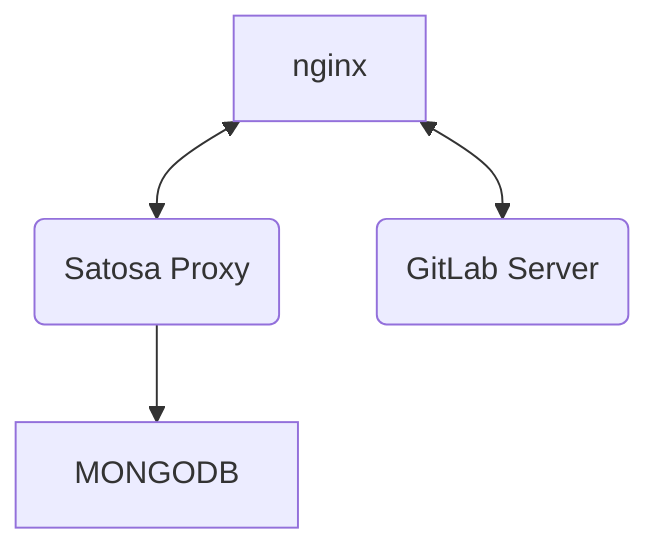

# Corso OIDC in IDEM via Proxy

## Struttura del docker compose
Il progetto contiene:
* docker-compose -  Il file con le istruzioni per avviare la struttura docker, incluso un container gitlab da utilizzare come RP
* satosa - directory contenente configurazioni, certificati e matadata per il proxy Satosa
* nginx - virtual host, certificati e file statici serviti dal webserver NGINX
* mongo - file di inizializzazione del server MongoDB, nel file `./mongo/mongo.json` sono presenti le registrazioni per le applicazioni OIDC
* jwt   - semplice applicazione per eseguire una rapido test di autenticazione

All'inizio del corso ad ogni partecipante verranno assegnati i nomi macchina da utilizzare per le applicazioni e i loro certificati. es:
* satosa-cp1.labwsgarr23.aai-test.garr.it per il proxy Satosa
* gitlab-cp1.labwsgarr23.aai-test.garr.it per l'RP Gitlab

## Compose

Il docker compose avvierà un server NGINX che farà da proxy verso i container di Satosa e Gitlab.
Le configurazioni dei virtual host sono nella directory `./nginx/conf.d/`
Il container di GitLab comprende tutti i servizi lui necessari (PG, Redis, Unicorn e l'applicazione Rails)
Satosa invece si connetterà ad un container MongoDB per la registrazione degli RP e delle sessioni OIDC

## Importare i certificati di nginx
Entrare nella directory `./nginx/certs/` e salvare i certificati per i virtual host Satosa e GitLab con i seguenti nomi:
* `satosa.key` - Chiave privata server satosa
* `satosa.pem` - Certificato pubblico server satosa
* `gitlab.key` - Chiave privata server GitLab
* `gitlab.pem` - Certificato pubblico server GitLab 

## Creare i certificati di satosa
* Entrare nella directory `./satosa/pki/`;
* Modificare `build_spid_certs.sh` con i dati del proprio ente;
* Generare i certificati self signed eseguendo lo script `./build_spid_certs.sh`.

## Preparare i dati di mongo
* Entrare nella directory `./mongo/`;
* Modificare il file `mongo.json` ed aggiornare i nomi degli host con quelli assegnati.

## Preparazione del file host
* Modificare il file di host `/etc/hosts` ed aggiungere gli host per il corso all'indirizzo di localhost, es:
```
127.0.1.1       localhost satosa-cp1.labwsgarr23.aai-test.garr.it gitlab-cp1.labwsgarr23.aai-test.garr.it
```

## Compose e verifica
* Modificare nel file `docker-compose.yml` le voci descrittive servizio;
* Eseguire l'infrastruttura di docker con il comando `sudo docker compose up`;
* Verificare l'attività dei servizi e i dati registrati dei metadata dai seguenti indirizzi:
* * https://satosa-cp1.labwsgarr23.aai-test.garr.it/Saml2/metadata (metadata SP IDEM)
* * https://satosa-cp1.labwsgarr23.aai-test.garr.it/spidSaml2/metadata (metadata SP SPID)
* * https://satosa-cp1.labwsgarr23.aai-test.garr.it/cieSaml2/metadata  (metadata SP CIE)
* * https://satosa-cp1.labwsgarr23.aai-test.garr.it/Saml2IDP/metadata (metadata dell'IDP per registrare i propri SP)
* * https://satosa-cp1.labwsgarr23.aai-test.garr.it/.well-known/openid-configuration (metadata OIDC)
* * https://wiki.idem.it (indirizzo wiki.js)

*Ricordarsi di modificare il dominio `idem.it` con il proprio dominio*

## Registrare l'SP nella federazione
* Collegarsi al sito registry.idem.garr.it
* Autenticarsi con le proprie credenziali IDEM
* Cliccare nel menu di testa alle voci `Register` e `Service Provider`
* Incollare nel form il metadata presente e proseguire
* Selezionare la federazione `WSGARR23`
* Far confermare la registrazione dai docenti presenti in sala

## Eseguire un accesso su gitlab
* Collegarsi al proprio host GitLab es: `gitlab-cp1.labwsgarr23.aai-test.garr.it`
* Cliccare sul bottone `WSGARR23` nella sezione `sign in with`
* Selezionare `IDEM` nella discovery page
* Autenticarsi con le credenziali:
* * user: test1
* * pass: test1

## In caso di errori eseguire una autenticazione di test con JWT e verificare i dati ricevuti
* Accedere alla directory `./jwt/`
* Modificare il file `satosa.json` ed aggiornare il dominio dell'issuer
* Creare il virtual env python con il comando `python -m venv ./env`
* Attivare il virtual env `source ./env/bin/activate`
* Aggiornare pip `pip install --upgrade pip`
* Installare le dipendenze `pip install -e .`
* Installare flask `pip install flask`
* Entrare nella directory example `cd example`
* Eseguire il client `python3 -m flask_rp.wsgi ../satosa.json`
* Aprire con un browser l'indirizzo https://127.0.0.1:8090
* Selezionare il provider 'satosa'
* Selezionare `IDEM` nella discovery page
* Autenticarsi con le credenziali:
* * user: test1
* * pass: test1
* Verificare l'accesso ed i dati ritornati

