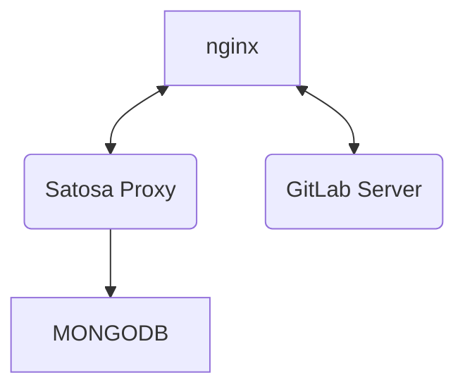

# 08/11/2023 - Corso per la registrazione di un servizio OIDC in IDEM utilizzando il proxy [Satosa-Saml2Spid](http.s://github.com/italia/Satosa-Saml2Spid) su docker
Il framework OpenID Connect è utilizzato sempre più frequentemente nuove applicazioni e sta sostituendo lentamente il protocollo SAML.

Al contrario il protocollo OIDC core non supporta nativamente i concetti di federazione e le specifiche OIDC Federation non hanno
raggiunto la diffusione necessaria per una migrazione completa delle Federazioni IDEM o eduGAIN.

In questa fase di cambiamenti capita di dover registrare applicazioni che nascono OIDC in federazioni SAML.
Per ovviare a questo problema, senza dover sviluppare un'intefaccia di autenticazione SAML, possiamo utilizzare un Proxy che prenda
le richieste OIDC e le invii ad una federazione SAML.

In questo corso utilizzeremo docker per istanziare un proxy [Satosa-Saml2Spid](https://github.com/italia/Satosa-Saml2Spid) e registrare
nella federazione IDEM un istanza di [GitLAB](https://about.gitlab.com/) che autentica via OIDC Core.

## obiettivi didattici
* Installare e configurare SaToSa con un frontend OpenID Connect provider ed un frontend SAML Service Provider
* Registrare il backend SAML Service Provider di SaToSa nella federazione IDEMLAB
* Registrare e configurare un’applicazione OpenID Connect (relying party) sul frontend OpenID Connect provider di SaToSa
* Verificare l’accesso all’applicazione OpenID Connect tramite un’Identity Provider SAML registrato nella federazione IDEMLAB

## Contenuto del repository
| Path           | Contenuto |
| -------------- | --------- |
| README.md      | Le itruzioni che stai leggendo! |
| docker-compose |  Il file con le istruzioni per avviare la struttura docker, incluso un container gitlab da utilizzare come RP |
| satosa         | directory contenente configurazioni, certificati e matadata per il proxy Satosa |
| nginx          | virtual host, certificati e file statici serviti dal webserver NGINX |
| mongo          | file di inizializzazione del server MongoDB, nel file `./mongo/mongo.json` sono presenti le registrazioni per le applicazioni OIDC |
| jwt            | semplice applicazione per eseguire una rapido test di autenticazione |

All'inizio del corso ad ogni partecipante verranno assegnati i nomi macchina da utilizzare per le applicazioni e i loro certificati. es:
* satosa-cp1.labwsgarr23.aai-test.garr.it per il proxy Satosa
* gitlab-cp1.labwsgarr23.aai-test.garr.it per l'RP Gitlab

## Compose

Il docker compose avvierà i seguenti container:
| Container        |   |
|----------------- | - |
| [satosa-nginx](#satosa-nginx)     | proxy HTTPS verso i container di satosa-saml2spid e Gitlab |
| [satosa-saml2spid](#satosa-saml2spid) | Proxy SAML <-> OIDC core |
| [satosa-mongo](#satosa-mongo)     | Archivio client e sessioni OIDC per satosa-saml2spid |
| gitlab           | RP OIDC |

### satosa-nginx
Image: nginx:alpine

Il container  `satosa-nginx` collega i seguenti volumi:
* [satosa.conf](nginx/conf.d/satosa.conf) con le configurazioni del vhost per [satosa-saml2spid](#satosa-saml2spid)
* [gitlab.conf](nginx/conf.d/gitlab.conf) con le configurazione del vhost per gitlab
* [certs](nginx/certs) directory contenente i certificati di nginx
* [static](nginx/static) directory contenente i file statici utilizzati per la discovery page di [satosa-saml2spid](#satosa-saml2spid)

Il contaner [satosa-nginx](#satosa-nginx) pubblica le porte `80` e `443` aperte su `0.0.0.0`.

Il container così strutturato non salva alcun dato in modo permanente e tutti i volumi vengono agganciati in sola lettura. Questo sistema è idoneao alla produzione in quanto il container non scrive alcun dato operativo ed i log vengono inviati al log driver di docker.

### satosa-saml2spid
Image: ghcr.io/italia/satosa-saml2spid:latest

il container `satosa-saml2spid` collega i seguenti volumi:
* [metadata](satosa/metadata) contiene le directory [idp](satosa/metadata/idp) e [sp](satosa/metadata/sp) con i rispettivi metadata SAML da servire.
* [pki](satosa/pki) directory contenente i certificati utilizzati da satosa oltre al file [build_spid_certs.sh](satosa/pki/build_spid_certs.sh) per generarli
* [saml2_backend.yaml](satosa/plugins/backends/saml2_backend.yaml) file di configurazione per il backend SAML2 da personalizzare eventualmente
* [oidcop_frontend.yaml](satosa/plugins/frontends/oidcop_frontend.yaml) file di configurazione per il frontend OIDC da personalizzare eventualmente

Il container [satosa-saml2spid](#satosa-saml2spid) non pubblica alcuna porta esternamente

Tramite gli enviroments è possibile configurare tutte le informazioni necessarie alla presentazione dei metadata SAML2 e OIDC.
Maggiori informazioni sono disponibili nella pagina dedicata al progetto [Satosa-Saml2Spid](http.s://github.com/italia/Satosa-Saml2Spid).

Il container così strutturato non salva alcun dato in modo permanente e tutti i volumi vengono agganciati in sola lettura. Questo sistema è idoneao alla produzione in quanto il container non scrive alcun dato operativo ed i log vengono inviati al log driver di docker.


### satosa-mongo
Image: mongo

Il container `satosa-mongo` collega i seguenti volumi:
* [init-mongo.sh](mongo/init-mongo.sh:/docker-entrypoint-initdb.d/init-mongo.sh) contenente l'inizializzazione degli utenti e del database mongo OIDCOP per [satosa-saml2spid](#satosa-saml2spid)
* [mongo.json](mongo/mongo.json:/docker-entrypoint-initdb.d/mongo.json) contenente i client che verranno registrati automaticamente all'avvio del container

Il container satosa-mongo non pubblica alcuna porta esternamente.

Tramite gli environment `MONGO_INITDB_DATABASE`, `MONGO_INITDB_ROOT_USERNAME` e `MONGO_INITDB_ROOT_PASSWORD` viene definito il db da inizializzare le credenziali dell'utente amministratore.

Il container così strutturato non salva nessun dato in modo permanente.
Questa configurazione può essere adatta alla produzione a patto che il numero dei client sia limitato (i client vengono reinseriti ad ogni inizializzazione) e che sia accettabile perdere le sessioni correnti in caso di re-inizializazione del container.
In caso contrario sarà necessario sarà necessario creare un volume (locale o statico) da collegare alla directory - `/data/db` del container. ES:
```
volumes:
  - ./mongo/mongodata:/data/db
```

### gitlab
Image: 'gitlab/gitlab-ce:latest'

Il container `gitlab` non collega alcun volume.

Tramite l'environment `GITLAB_OMNIBUS_CONFIG` viene definito il nome host a cui deve rispondere il server gitlab oltre la configurazione dell'autenticazione OIDC.
Maggiori informazioni sono disponibili nella documentazione [GitLAB](https://docs.gitlab.com/)

Questa configurazione non è adatta alla produzione in quanto non salva alcun dato in modo permanente mentre i dati del server git lo sono per definizione. Per rendere permanenti i dati di GitLab sarà necessario montare un volume (logico o statico) alla directory `/var/opt/gitlab`, un volume per la conservazione dei log su `/var/log/gitlab` ed un volume per le eventuali configurazioni manuali necessarie `/etc/gitlab`. ES:
```
volumes:
  - '$GITLAB_HOME/config:/etc/gitlab'
  - '$GITLAB_HOME/logs:/var/log/gitlab'
  - '$GITLAB_HOME/data:/var/opt/gitlab'
```

## Inizializzazione del sistema di test
Le procedure di seguito riportate servono per configurare, creare e rendere operativa l'infrastruttura proposta negli obiettivi formativi ossia un server GitLab che si autentica su IDEM con il protocollo OIDC sfruttando un satosa Proxy.

I partecipanti al corso riceveranno al loro arrivo i nomi DNS dei server che dovranno utilizzare durante il corso. ES:
* satosa-cp12.labwsgarr23.aai-test.garr.it per il server satosa
* gitlab-cp12.labwsgarr23.aai-test.garr.it per il server gitlab

Insieme al nome DNS verrà consegnato anche un certificato valido per entrambi i nomi macchina. ES:
* privkey.pem con la chiave privata
* fullchain.pem con la chiave pubblica con incluse le chiavi dei firmatari

Tutte le configurazioni presenti nel repository fanno riferimento ai nomi `satosa-cp12.labwsgarr23.aai-test.garr.it` e `gitlab-cp12.labwsgarr23.aai-test.garr.it` ed andranno aggiornate di conseguenza.
Per provare il proxy esternamente al corso sarà necessario utilizzare nomi DNS differenti e generare certificati validi adatti.

### Prerequisiti
In tutte le procedure viene considerato che si sta lavorando su un computer locale con una versione di linux recente con installato Docker, Docker compose e python3.x.
Nelle procedure viene dato scontato che abbiate confidenza con la console di linux e con gli editor testuali.

### Importare i certificati di nginx
Copiare i certificati consegnati (`privkey.pem` e `fullchain.pem`) nella directory [nginx/certs](nginx/certs).

Chi esegue la procedura autonomamente può creare un certificato con i due alias e salvarli con gli stessi nomi o in alternativa si possono creare certificati separati aggiornando le configurazioni dei virtualhost di [NGINX](nginx/conf.d). es:
* `satosa.key` - Chiave privata server satosa
* `satosa.pem` - Certificato pubblico server satosa
* `gitlab.key` - Chiave privata server GitLab
* `gitlab.pem` - Certificato pubblico server GitLab 

### Creare i certificati di satosa
L'autenticazione SAML necessità di un certificato per la firma delle asserzioni, tale certificato normalmente può essere anche self signed. Nel seguente esempio utilizzeremo lo script per la generazione di un certificato self signed valido sia per la federazione IDEM che per la federazione SPID e CIE per le pubbliche amministrazione:

* Entrare nella directory `./satosa/pki/`;
* Aprire il file `build_spid_certs.sh` con il proprio editor preferito e modificare le seguenti righe:
* * riga 4, `COMMON_NAME=#{identificativo}` aggiornare con il nome breve o acronimo del proprio ente
* * riga 5, `LOCALITY_NAME=#{città}` aggiornare con la città della sede di riferimento ES: `Roma`
* * riga 6, `ORGANIZATION_IDENTIFIER=#{codice ipa}}` aggiornare con il codice IPA del proprio ente es: `PA:IT-ispra_rm`
* * riga 7, `ORGANIZATION_NAME=#{nome ente}` aggiornare con il completo dell'ente
* * riga 9, `URI=#{indirizzo}` aggiornare con l'url completo del proprio service provider es: `satosa-cp12.labwsgarr23.aai-test.garr.it`
* * salvare e chiudere il file
* Generare i certificati self signed eseguendo lo script `./build_spid_certs.sh`.

Lo script genererà nella directory corrente i file `cert.pem` e `privkey.pem`. Possono essere importati anche certificati preesistenti a patto che vengano rinominati allo stesso modo.

### Preparare i dati da importare su MongoDB
All'avvio del container [satosa-mongo](#satosa-mongo) verrà inizializzato il database (di default `oidcop`) e verranno importati i dati contenuti nel file [mongo.json](mongo/mongo.json).

Nel file [mongo.json](mongo/mongo.json) sono presenti i dati di configurazione del client Python [JWT](jwt) presente nel reposytory e i dati di esemprio per la configurazione del server gitlab.
Prima di avviare il compose sarà necessario aggiornare il nome hosrt per il server gitlab come segue:
* Entrare nella directory `./mongo/`;
* Aprire il file `mongo.json` con il proprio editor preferito e modificare le seguenti righe:
* * Aggiornare il nome host per il redirect url. ES: `"redirect_uris": [["https://gitlab-cp1.labwsgarr23.aai-test.garr.it/users/auth/openid_connect/callback", {}]],`
* * Aggiornare il nome host per il logout. ES: `"post_logout_redirect_uris": [["https://gitlab-cp1.labwsgarr23.aai-test.garr.it", null]],`
* * salvare e chiudere il file

### Preparazione del file host
* Aprire con diritti amministrativi il file `/etc/hosts` ed aggiungere gli host per il corso all'indirizzo di localhost, es:
```
127.0.1.1       localhost satosa-cp1.labwsgarr23.aai-test.garr.it gitlab-cp1.labwsgarr23.aai-test.garr.it
```
### Aggiornare i virtual host di NGINX
Entrare nella directory `nginx/conf.d`.
* Aprire il file `satosa.conf` con il proprio editor preferito e modificare le seguenti righe:
* riga 9, aggiornare il server name con il proprio nome host. ES: `  server_name satosa-cp1.labwsgarr23.aai-test.garr.it;`
* riga 14, aggiornare il server name con il proprio nome host. ES: `  server_name satosa-cp1.labwsgarr23.aai-test.garr.it;`
* salvare e chiudere
* Aprire il file `gitlab.conf` con il proprio editor preferito e modificare le seguenti righe:
* riga 8, aggiornare il server name con il proprio nome host. ES: `  server_name gitlab-cp1.labwsgarr23.aai-test.garr.it;`
* riga 13, aggiornare il server name con il proprio nome host. ES: `  server_name gitlab-cp1.labwsgarr23.aai-test.garr.it;`
* salvare e chiudere

### Environment del file compose
Aprire il file [docker-compose.yml](docker-compose.yml) con il proprio editor preferito per modificare gli environment e gli alias.

Per il servizio [satosa-saml2spid](#satosa-saml2spid) aggiorare l'url alle seguenti chiavi:
* `SATOSA_BASE` con la base url del proprio host satosa. ES: `SATOSA_BASE=https://satosa-cp1.labwsgarr23.aai-test.garr.it`
* `SATOSA_DISCO_SRV` con l'url della propria discovery page. ES: `SATOSA_DISCO_SRV=https://satosa-cp1.labwsgarr23.aai-test.garr.it/static/disco.html`
* `SATOSA_UNKNOW_ERROR_REDIRECT_PAGE` con l'indirizzo della pagina di errore generica `SATOSA_UNKNOW_ERROR_REDIRECT_PAGE=https://satosa-cp1.labwsgarr23.aai-test.garr.it/static/error_page.html`

Per il servizio [satosa-saml2spid](#satosa-saml2spid) aggiorare anche le informazioni dei metadati present alle righe 30-35, 40-45, 48-58.

Per il servizio [satosa-nginx](#satosa-nginx) aggiornare il nome dell'alias con quello effettivamente utilizzato:
* riga 89, chiave `networks.satosa.aliases`. ES: `- satosa-cp1.labwsgarr23.aai-test.garr.it`

Per il servizio gitlab aggiornare i seguenti dati:
* riga 108, `issuer` aggiornare l'url del server satosa. ES: `issuer: "https://satosa-cp1.labwsgarr23.aai-test.garr.it",`
* riga 118, `redirect_uri`, aggiornare l'url del server gitlab. ES: `redirect_uri: "https://gitlab-cp1.labwsgarr23.aai-test.garr.it/users/auth/openid_connect/callback",`
* riga 133,  chiave `networks.satosa.aliases`, aggiornare l'url dell alias. ES: `- gitlab-cp1.labwsgarr23.aai-test.garr.it`

In caso di un servizio in produzione sarà necessario aggiornare anche i seguenti dati:
* passowrd di mongo alle righe 10 e 38
* `SATOSA_SALT` alla riga 46
* `SATOSA_USER_ID_HASH_SALT` alla riga 60
* Aggiornare secret e identifier del client OIDC alle righe 116, 117 ed i loro corrispettivi nel file [json di mongo](mongo/mongo.json)

### Compose e verifica
* Eseguire l'infrastruttura di docker con il comando `sudo docker compose up`;
* Verificare l'attività dei servizi e i dati registrati dei metadata dai seguenti indirizzi:
* * https://satosa-cp1.labwsgarr23.aai-test.garr.it/Saml2/metadata (metadata SP IDEM)
* * https://satosa-cp1.labwsgarr23.aai-test.garr.it/spidSaml2/metadata (metadata SP SPID)
* * https://satosa-cp1.labwsgarr23.aai-test.garr.it/cieSaml2/metadata  (metadata SP CIE)
* * https://satosa-cp1.labwsgarr23.aai-test.garr.it/Saml2IDP/metadata (metadata dell'IDP per registrare i propri SP)
* * https://satosa-cp1.labwsgarr23.aai-test.garr.it/.well-known/openid-configuration (metadata OIDC)
* * https://wiki.idem.it (indirizzo wiki.js)

*Ricordarsi di modificare il dominio `idem.it` con il proprio dominio*

### Registrare l'SP nella federazione
* Collegarsi al sito registry.idem.garr.it
* Autenticarsi con le proprie credenziali IDEM
* Cliccare nel menu di testa alle voci `Register` e `Service Provider`
* Incollare nel form il metadata presente e proseguire
* Selezionare la federazione `WSGARR23`
* Far confermare la registrazione dai docenti presenti in sala

### Eseguire un accesso su gitlab
* Collegarsi al proprio host GitLab es: `gitlab-cp1.labwsgarr23.aai-test.garr.it`
* Cliccare sul bottone `WSGARR23` nella sezione `sign in with`
* Selezionare `IDEM` nella discovery page
* Autenticarsi con le credenziali:
* * user: test1
* * pass: test1

### In caso di errori eseguire una autenticazione di test con JWT e verificare i dati ricevuti
* Accedere alla directory `./jwt/`
* Modificare il file `satosa.json` ed aggiornare il dominio dell'issuer
* Creare il virtual env python con il comando `python -m venv ./env`
* Attivare il virtual env `source ./env/bin/activate`
* Aggiornare pip `pip install --upgrade pip`
* Installare le dipendenze `pip install -e .`
* Installare flask `pip install flask`
* Entrare nella directory example `cd example`
* Eseguire il client `python3 -m flask_rp.wsgi ../satosa.json`
* Aprire con un browser l'indirizzo https://127.0.0.1:8090
* Selezionare il provider 'satosa'
* Selezionare `IDEM` nella discovery page
* Autenticarsi con le credenziali:
* * user: test1
* * pass: test1
* Verificare l'accesso ed i dati ritornati

