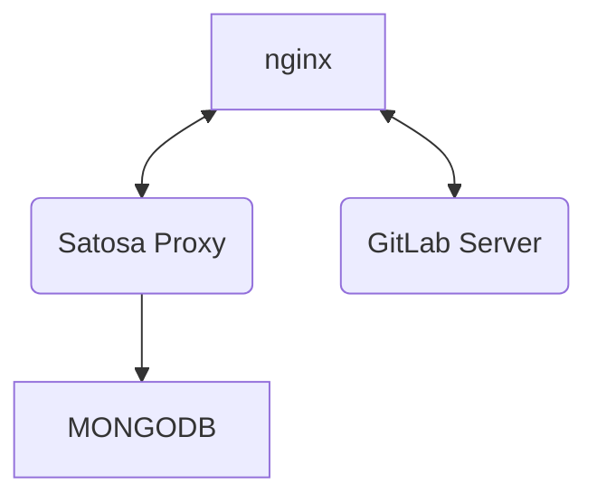

# 08/11/2023 - Corso per la registrazione di un servizio OIDC in IDEM utilizzando il proxy Satosa-Saml2Spid su docker
Il framework OpenID Connect è utilizzato sempre più frequentemente nuove applicazioni e sta sostituendo lentamente il protocollo SAML.

Al contrario il protocollo OIDC core non supporta nativamente i concetti di federazione e le specifiche OIDC Federation non hanno
raggiunto la diffusione necessaria per una migrazione completa delle Federazioni IDEM o eduGAIN.

In questa fase di cambiamenti capita di dover registrare applicazioni che nascono OIDC in federazioni SAML.
Per ovviare a questo problema, senza dover sviluppare un'intefaccia di autenticazione SAML, possiamo utilizzare un Proxy che prenda
le richieste OIDC e le invii ad una federazione SAML.

In questo corso utilizzeremo docker per istanziare un proxy [Satosa-Saml2Spid](https://github.com/italia/Satosa-Saml2Spid) e registrare
nella federazione IDEM un istanza di [GitLAB](https://about.gitlab.com/) che autentica via OIDC Core.

## obiettivi didattici
* Installare e configurare SaToSa con un frontend OpenID Connect provider ed un frontend SAML Service Provider
* Registrare il backend SAML Service Provider di SaToSa nella federazione IDEMLAB
* Registrare e configurare un’applicazione OpenID Connect (relying party) sul frontend OpenID Connect provider di SaToSa
* Verificare l’accesso all’applicazione OpenID Connect tramite un’Identity Provider SAML registrato nella federazione IDEMLAB

## Contenuto del repository
| Path           | Contenuto |
| -------------- | --------- |
| README.md      | Le itruzioni che stai leggendo! |
| docker-compose |  Il file con le istruzioni per avviare la struttura docker, incluso un container gitlab da utilizzare come RP |
| satosa         | directory contenente configurazioni, certificati e matadata per il proxy Satosa |
| nginx          | virtual host, certificati e file statici serviti dal webserver NGINX |
| mongo          | file di inizializzazione del server MongoDB, nel file `./mongo/mongo.json` sono presenti le registrazioni per le applicazioni OIDC |
| jwt            | semplice applicazione per eseguire una rapido test di autenticazione |

All'inizio del corso ad ogni partecipante verranno assegnati i nomi macchina da utilizzare per le applicazioni e i loro certificati. es:
* satosa-cp1.labwsgarr23.aai-test.garr.it per il proxy Satosa
* gitlab-cp1.labwsgarr23.aai-test.garr.it per l'RP Gitlab

## Compose

Il docker compose avvierà i seguenti container:
| Container        |   |
|----------------- | - |
| satosa-nginx     | proxy HTTPS verso i container di satosa-saml2spid e Gitlab |
| satosa-saml2spid | Proxy SAML <-> OIDC core |
| satosa-mongo     | Archivio client e sessioni OIDC per satosa-saml2spid |
| gitlab           | RP OIDC |

### satosa-nginx
Image: nginx:alpine

Il container  `satosa-nginx` collega i seguenti volumi:
* [satosa.conf](nginx/conf.d/satosa.conf) con le configurazioni del vhost per satosa-satml2spid
* [gitlab.conf](nginx/conf.d/gitlab.conf) con le configurazione del vhost per gitlab
* [certs](nginx/certs) directory contenente i certificati di nginx
* [static](nginx/static) directory contenente i file statici utilizzati per la discovery page di satosa-saml2spid

Il contaner satosa-nginx pubblica le porte `80` e `443` aperte su `0.0.0.0`.

### satosa-saml2spid
Image: ghcr.io/italia/satosa-saml2spid:latest

il container `satosa-saml2spid` collega i seguenti volumi:
* [metadata](satosa/metadata) contiene le directory [idp](satosa/metadata/idp) e [sp](satosa/metadata/sp) con i rispettivi metadata SAML da servire.
* [pki](satosa/pki) directory contenente i certificati utilizzati da satosa oltre al file [build_spid_certs.sh](satosa/pki/build_spid_certs.sh) per generarli
* [saml2_backend.yaml](satosa/plugins/backends/saml2_backend.yaml) file di configurazione per il backend SAML2 da personalizzare eventualmente
* [oidcop_frontend.yaml](satosa/plugins/frontends/oidcop_frontend.yaml) file di configurazione per il frontend OIDC da personalizzare eventualmente

Il container satosa-saml2spid non pubblica alcuna porta esternamente

Tramite gli enviroments è possibile configurare tutte le informazioni necessarie alla presentazione dei metadata SAML2 e OIDC.
Maggiori informazioni sono disponibili nella pagina dedicata al progetto [Satosa-Saml2Spid](http.s://github.com/italia/Satosa-Saml2Spid).

### satosa-mongo
Image: mongo

Il container `satosa-mongo` collega i seguenti volumi:
* [init-mongo.sh](mongo/init-mongo.sh:/docker-entrypoint-initdb.d/init-mongo.sh) contenente l'inizializzazione degli utenti e del database mongo OIDCOP per satosa-saml2spid
* [mongo.json](mongo/mongo.json:/docker-entrypoint-initdb.d/mongo.json) contenente i client che verranno registrati automaticamente all'avvio del container

Il container satosa-mongo non pubblica alcuna porta esternamente.

Tramite gli environment `MONGO_INITDB_DATABASE`, `MONGO_INITDB_ROOT_USERNAME` e `MONGO_INITDB_ROOT_PASSWORD` viene definito il db da inizializzare le credenziali dell'utente amministratore.

### gitlab
Image: 'gitlab/gitlab-ce:latest'

Il container `gitlab` non collega alcun volume.

Tramite l'environment `GITLAB_OMNIBUS_CONFIG` viene definito il nome host a cui deve rispondere il server gitlab oltre la configurazione dell'autenticazione OIDC.
Maggiori informazioni sono disponibili nella documentazione [GitLAB](https://docs.gitlab.com/)

## Importare i certificati di nginx
Entrare nella directory `./nginx/certs/` e salvare i certificati per i virtual host Satosa e GitLab con i seguenti nomi:
* `satosa.key` - Chiave privata server satosa
* `satosa.pem` - Certificato pubblico server satosa
* `gitlab.key` - Chiave privata server GitLab
* `gitlab.pem` - Certificato pubblico server GitLab 

## Creare i certificati di satosa
* Entrare nella directory `./satosa/pki/`;
* Modificare `build_spid_certs.sh` con i dati del proprio ente;
* Generare i certificati self signed eseguendo lo script `./build_spid_certs.sh`.

## Preparare i dati di mongo
* Entrare nella directory `./mongo/`;
* Modificare il file `mongo.json` ed aggiornare i nomi degli host con quelli assegnati.

## Preparazione del file host
* Modificare il file di host `/etc/hosts` ed aggiungere gli host per il corso all'indirizzo di localhost, es:
```
127.0.1.1       localhost satosa-cp1.labwsgarr23.aai-test.garr.it gitlab-cp1.labwsgarr23.aai-test.garr.it
```

## Compose e verifica
* Modificare nel file `docker-compose.yml` le voci descrittive servizio;
* Eseguire l'infrastruttura di docker con il comando `sudo docker compose up`;
* Verificare l'attività dei servizi e i dati registrati dei metadata dai seguenti indirizzi:
* * https://satosa-cp1.labwsgarr23.aai-test.garr.it/Saml2/metadata (metadata SP IDEM)
* * https://satosa-cp1.labwsgarr23.aai-test.garr.it/spidSaml2/metadata (metadata SP SPID)
* * https://satosa-cp1.labwsgarr23.aai-test.garr.it/cieSaml2/metadata  (metadata SP CIE)
* * https://satosa-cp1.labwsgarr23.aai-test.garr.it/Saml2IDP/metadata (metadata dell'IDP per registrare i propri SP)
* * https://satosa-cp1.labwsgarr23.aai-test.garr.it/.well-known/openid-configuration (metadata OIDC)
* * https://wiki.idem.it (indirizzo wiki.js)

*Ricordarsi di modificare il dominio `idem.it` con il proprio dominio*

## Registrare l'SP nella federazione
* Collegarsi al sito registry.idem.garr.it
* Autenticarsi con le proprie credenziali IDEM
* Cliccare nel menu di testa alle voci `Register` e `Service Provider`
* Incollare nel form il metadata presente e proseguire
* Selezionare la federazione `WSGARR23`
* Far confermare la registrazione dai docenti presenti in sala

## Eseguire un accesso su gitlab
* Collegarsi al proprio host GitLab es: `gitlab-cp1.labwsgarr23.aai-test.garr.it`
* Cliccare sul bottone `WSGARR23` nella sezione `sign in with`
* Selezionare `IDEM` nella discovery page
* Autenticarsi con le credenziali:
* * user: test1
* * pass: test1

## In caso di errori eseguire una autenticazione di test con JWT e verificare i dati ricevuti
* Accedere alla directory `./jwt/`
* Modificare il file `satosa.json` ed aggiornare il dominio dell'issuer
* Creare il virtual env python con il comando `python -m venv ./env`
* Attivare il virtual env `source ./env/bin/activate`
* Aggiornare pip `pip install --upgrade pip`
* Installare le dipendenze `pip install -e .`
* Installare flask `pip install flask`
* Entrare nella directory example `cd example`
* Eseguire il client `python3 -m flask_rp.wsgi ../satosa.json`
* Aprire con un browser l'indirizzo https://127.0.0.1:8090
* Selezionare il provider 'satosa'
* Selezionare `IDEM` nella discovery page
* Autenticarsi con le credenziali:
* * user: test1
* * pass: test1
* Verificare l'accesso ed i dati ritornati

